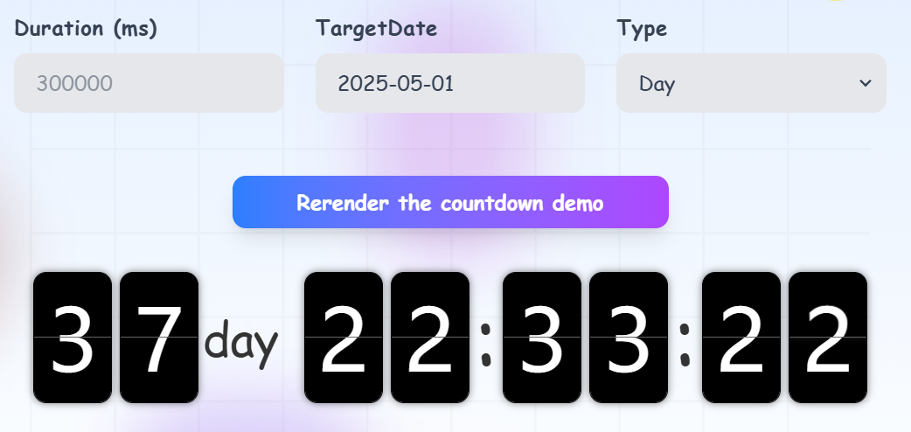

# React-Flip-Countdown

## 简介

`React-Flip-Countdown` 是一个基于 React 的翻牌倒计时组件，支持动态显示天、小时、分钟和秒的倒计时效果。它通过 `FlipCard` 子组件实现翻牌动画，并提供灵活的配置选项以满足不同的倒计时需求。

---

## 参考

核心原理来自：[Yuezi32/flipClock: 翻牌效果时钟的演示，包含原生JavaScript、Vue、React三种实现方式。](https://github.com/Yuezi32/flipClock)

感谢 [Yuezi32 (BetaQ)](https://github.com/Yuezi32) 大佬的开源代码。对`ClipCard`组件修改复用可以实现各种不同功能的翻牌器组件。

---

## 线上演示

[React-Flip-Countdown](https://react-flip-countdown.vercel.app/)


---

## 使用示例

```tsx
import React from 'react';
import FlipCountdown from './components/flip-countdown';

const App = () => {
  const handleEnded = () => {
    console.log('倒计时结束！');
  };

  return (
    <div>
      <h1>FlipCountdown 示例</h1>
      <FlipCountdown
        type="Day"
        duration={1000 * 60 * 5} // 5 分钟倒计时
        onEnded={handleEnded}
      />
    </div>
  );
};

export default App;
```

---

## 依赖库

- React：用于构建组件；
- Tailwind CSS：补充样式方案；
- clsx：轻量级的高性能`classNames`替代方案；
- dayjs：不必多言；
- react-hot-toast：一个不错的 React 通知库，不装`antd`时我就用ta；
- React Hook Form：React 高性能表单库。


> 以上依赖库都是非必需的，不过作者强烈推荐。
>
> 可以在`FlipCard`、`FlipCountdown`文件中的`js`、`css`代码上自行修改以适配不同的前端框架。

---

## 属性说明

| 参数名       | 类型                                   | 默认值      | 描述                                                         |
| ------------ | -------------------------------------- | ----------- | ------------------------------------------------------------ |
| `duration`   | `number`                               | `undefined` | 倒计时的持续时间（以毫秒为单位）。如果未设置，则默认为 5 分钟。 |
| `type`       | `'Day' /| 'Hour' /| 'Minute' /| 'Second'` | `'Day'`     | 倒计时的显示类型。可选值包括：`Day`、`Hour`、`Minute`、`Second`。 |
| `targetDate` | `Date`                                 | `undefined` | 目标时刻。如果同时设置了 `duration` 和 `targetDate`，以 `targetDate` 为准。 |
| `onEnded`    | `() => void`                           | `undefined` | 倒计时结束时的回调函数。                                     |

---

## 注意事项

1. **`duration` 和 `targetDate` 的优先级**  

   - 如果同时设置了 `duration` 和 `targetDate`，以 `targetDate` 为准。
   - 如果两者均未设置，默认倒计时时间为 5 分钟。

2. **`type` 属性的作用**  

   - 控制倒计时显示的时间单位范围。例如：
     - `'Day'`：仅显示天数。
     - `'Hour'`：显示天数和小时。
     - `'Minute'`：显示天数、小时和分钟。
     - `'Second'`：显示天数、小时、分钟和秒。

   > 注意：该选项的功能只是截取，不展示前面的卡片。例如如果选择`Hour`，而`duration`超过1天，或者`targetDate`在1天以后，并不会将时间转化成对应的小时数，而是减去24小时。

3. **样式依赖**  

   - 组件依赖 `index.module.less` 文件中的样式，请确保正确引入。
   - 支持响应式设计，适配不同屏幕尺寸。

4. **翻牌动画**  

   - 翻牌动画由 `FlipCard` 子组件实现，动画持续时间与 CSS 中的 `animation-duration` 保持一致。

5. **自定义**

   - 可以通过修改`formatRemaining`方法，来自定义时间展示逻辑。

---

## 示例场景

### 场景 1：目标时刻倒计时

#### 代码

```tsx
<FlipCountdown
  type="Day"
  targetDate={new Date('2025-05-01T23:59:59')}
  onEnded={() => alert('工人伟大，劳动光荣！')}
/>
```

#### 效果



### 场景 2：固定时长倒计时

#### 代码

```tsx
<FlipCountdown
  type="Minute"
  duration={1000 * 60 * 10} // 10 分钟倒计时
  onEnded={() => console.log('倒计时结束！')}
/>
```

#### 效果


### 场景 3：仅显示秒数

#### 代码

```tsx
<FlipCountdown
  type="Second"
  targetDate={new Date('2025-03-24T00:00:00')}
/>
```

#### 效果


---

## 样式说明

组件样式通过 `index.module.less` 文件定义，支持以下特性：

- **响应式设计**：根据屏幕尺寸调整字体大小和布局。
- **翻牌动画**：通过 CSS 动画实现翻转效果。
- **自定义样式**：可以通过覆盖 `index.module.less` 中的类名来自定义样式。

---


## 许可证

本项目采用 MIT 许可证。详情请参阅 [LICENSE](LICENSE) 文件。

---


组件目前功能较少，内部逻辑实现也比较简陋。如有任何问题或建议，请随时联系作者或提交 issue。欢迎各位同行和代码爱好者 star、 issue和 pr。